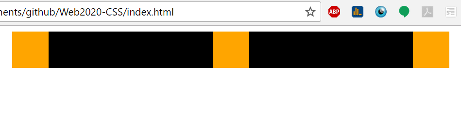
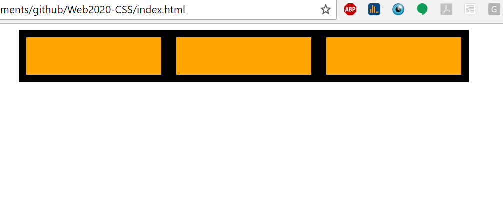

#Web2020 Exam 1

For questions 1 through 8, start with the following html and css:

```html
  <div class="cont">
    <div class="box"></div>
    <div class="box"></div>
    <div class="box"></div>
  </div>
```

```css
.cont{
  background-color: black;
  width: 600px;
  margin: 0 auto;
}
.box{
  width: 50px;
  height: 50px;
  background-color: orange;
}
```

###Question 1
Describe the simplest CSS changes required to create the following layout **using flexbox properties**:



  .cont{
      display: flex;
      flex-direction: row;
      justify-content: space-between;
  }

###Question 2
Describe the simplest CSS changes required to create the following layout **using flexbox properties**:


  .cont{
      display: flex;
      flex-direction: column;
  }

  .box{
      margin-bottom: 16.66px;
  }

###Question 3
Describe the simplest CSS changes required to create the following layout **using flexbox properties**:


  .cont{
      display: flex;
      flex-direction: column;
      align-items: center;
      height: 200px;
  }

  .box{
      margin-bottom: 16.66px;
  }

###Question 4
Describe the simplest CSS changes required to create the following layout **using flexbox properties**:


 .cont{
      display: flex;
      justify-content: center;
      flex-direction: row;
  }

  .box{
      margin: 10px;
  }

###Question 5
(Hint, give the container a height of 300px)
Describe the simplest CSS changes required to create the following layout **using flexbox properties**:


.cont{
    display: flex;
    height: 300px;
    justify-content: center;
    flex-direction: row;
}

.box{
    margin: 10px;
}
.box:nth-of-type(1) {
    align-self: flex-end;
}

###Question 6
(Hint, give the container a height of 300px)
Describe the simplest CSS changes required to create the following layout **using flexbox properties**:


.cont{
    display: flex;
    height: 300px;
    justify-content: space-around;
    flex-direction: row;
}

.box{
    margin: 10px;
}
.box:nth-of-type(1) {
    align-self: flex-end;
}

###Question 7
Describe the simplest CSS changes required to create the following layout **using flexbox properties**:


  .cont{
      display: flex;
      justify-content: space-around;
      flex-direction: row;
  }

  .box{
      margin: 10px;
  }

###Question 8
(Hint: requires the flex-grow or flex shorthand property)
Describe the simplest CSS changes required to create the following layout **using flexbox properties**:



  .cont{
      display: flex;
      justify-content: space-around;
      flex-direction: row;
  }

  .box{
      margin: 10px;
      flex-grow: 3;
  }
